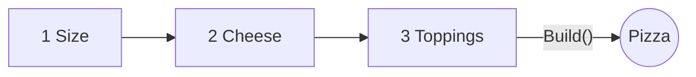

// Creational · 3 of 3

# 🟢 Builder

```mermaid
flowchart LR
    S1[1 Size] --> S2[2 Cheese] --> S3[3 Toppings] -- "Build()" --> P((Pizza))
```

> 🔴 **PROBLEM** 
> Huge constructors, many parameters

> 🟢 **BENEFIT** 
> Build complex objects step by step