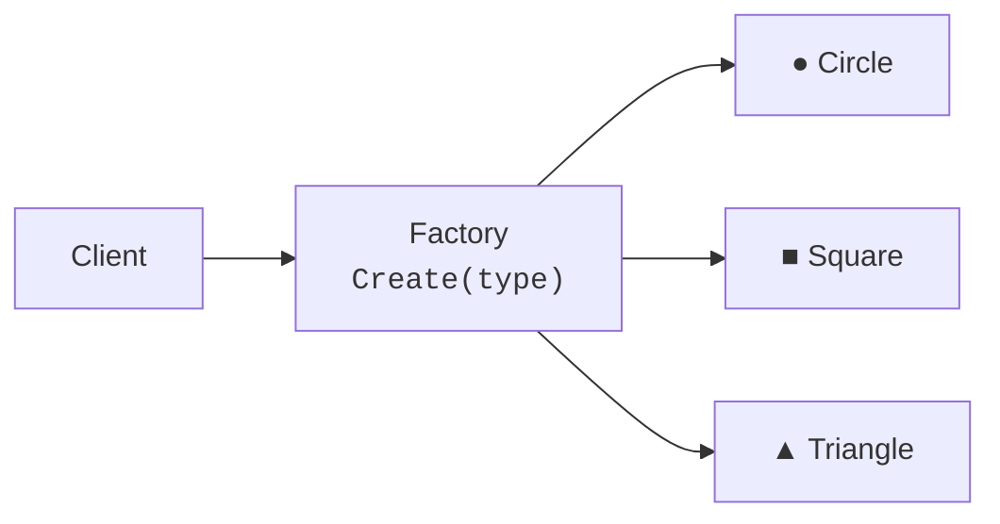

// Creational · 2 of 3

# 🟢 Factory Method

```mermaid
flowchart LR
    Cl[Client] --> F["Factory<br/><code>Create(type)</code>"]
    F --> Ci[● Circle]
    F --> Sq[■ Square]
    F --> Tr[▲ Triangle]
```

> 🔴 **PROBLEM** 
> "new" scattered across the code

> 🟢 **BENEFIT** 
> Object creation in one place