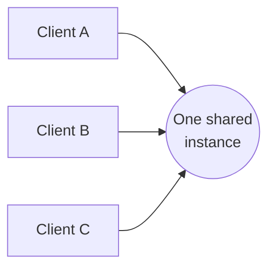

// Creational · 1 of 3

# 🟢 Singleton

```mermaid
flowchart LR
    A[Client A] --> I((One shared<br/>instance))
    B[Client B] --> I
    C[Client C] --> I
```

> 🔴 **PROBLEM** 
> Multiple copies of a shared resource

> 🟢 **BENEFIT** 
> One controlled, shared instance