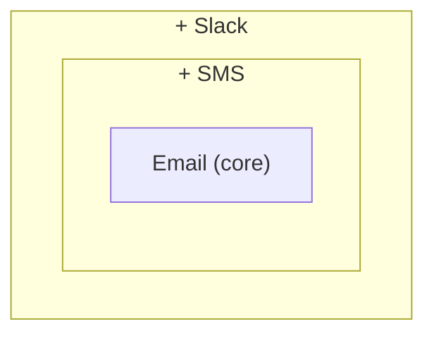

// Structural · 2 of 3

# 🔵 Decorator

```mermaid
flowchart TB
    subgraph Slack["+ Slack"]
        subgraph SMS["+ SMS"]
            E["Email (core)"]
        end
    end
```

> 🔴 **PROBLEM** 
> Too many subclasses for combinations

> 🟢 **BENEFIT** 
> Add features at runtime by wrapping